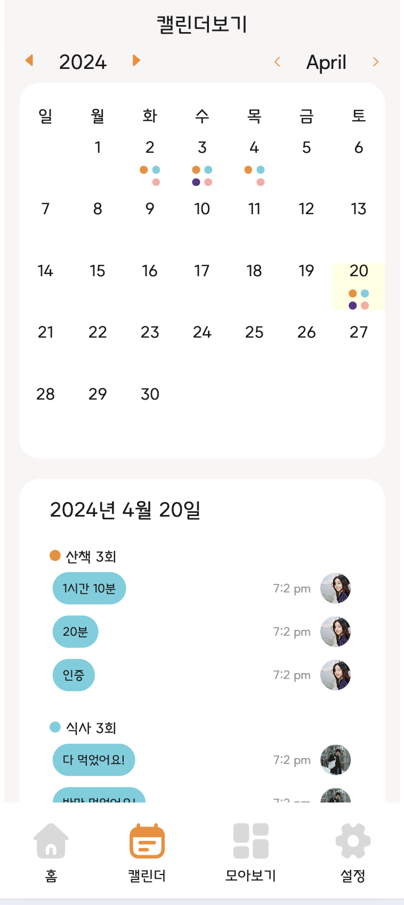

# 멍스토리 FE 프로젝트

<p>


</p>

<br/>

## 프로젝트 기간

2023.3.25 ~ 진행 중

- 현재 MSW를 활용하여 Mock API로 동작 및 구현 중입니다.

## 프로젝트 내용

간단한 인증 버튼을 통한 관련된 사람들과의 '공동 육견'

### 프로젝트 프리뷰

| 메인                                        | 업로드                                        | 캘린더                                          | 슬라이드                                     | 그리드                                      | 인트로                                       |
| ------------------------------------------- | --------------------------------------------- | ----------------------------------------------- | -------------------------------------------- | ------------------------------------------- | -------------------------------------------- |
|  |  |  |  |  |  |

### 프로젝트 상세 내용

- [기능명세서](https://www.figma.com/file/HDEK7KrWQSJK8Cjlb9oycx/%EB%A9%8D%EC%8A%A4%ED%86%A0%EB%A6%AC?type=whiteboard&node-id=0-1&t=skrDaMrDQeMiUW4o-0)
- [페이지 흐름을 Funnel 컴포넌트로 추상화](https://github.com/meong-story/meong-story-FE/pull/20)하고 재사용 가능하도록 커스텀 훅 생성
- 병렬적 개발을 위해 MSW를 이용한 **모의 API 환경 구성**
- 세부적인 에러 핸들링을 위하여 커스텀 에러와 Error boundary 를 활용
  - [Api Error boundary와 QueryErrorResetBoundary을 결합하여 ErrorResetBoundaryWrapper 생성](https://github.com/meong-story/meong-story-FE/pull/87)
- 리스트 항목은 사용자 편의를 위하여, intersection observer API를 사용한 무한스크롤 구현

## 배포

[현재 mock Api로 확인할 수 있는 배포 사이트](https://meong-story.vercel.app/)<br/>

## 프로젝트 실행 방법

1. Clone the repo

```javascript
$ git clone https://github.com/meong-story/meong-story-FE.git
```

2. Install NPM packages

```javascript
$ npm install
```

3. Getting Started

```javascript
$ npm run dev
```

<br/>
